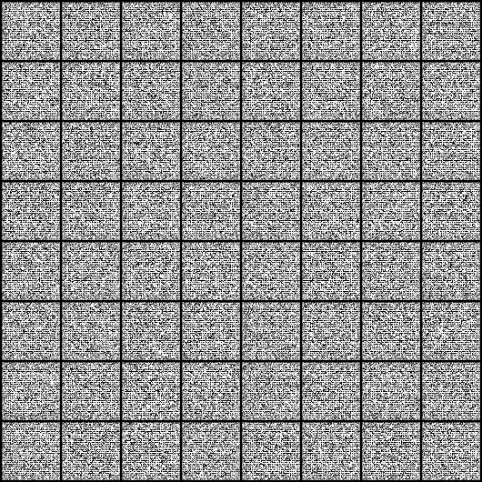
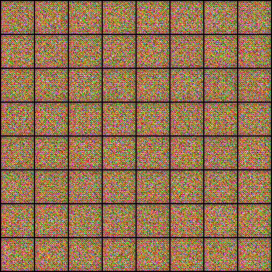

# DCGAN Implementation

## 1. Implementation of Deep Convolutional Generative Adversarial Networks (DCGANs)

This project implements a **Deep Convolutional Generative Adversarial Network (DCGAN)**, as proposed in the seminal paper by **Radford et al.** DCGAN extends the basic GAN architecture with convolutional layers, batch normalization, and specific architectural constraints, making it especially effective for generating high-quality image samples. The model is trained in an adversarial setting, where the **generator** creates fake images and the **discriminator** distinguishes between real and generated images.

---

## 2. General Overview of the Project

This DCGAN implementation supports training on multiple datasets and is structured into distinct modules for clarity and scalability:

- **Configs**: Configuration files for managing hyperparameters, dataset paths, and training settings.
- **Data**: Handles downloading, loading, and preprocessing datasets (e.g., **MNIST**, **CIFAR10**, **CELEBA**).
- **Models**: Contains the architecture definitions for the **generator** and **discriminator**.
- **Utils**: Includes utility functions for training, saving models, generating sample images, and creating gifs.
- **Outputs**: Directory for saving generated images, gifs, and model checkpoints for each dataset.
- **Tests**: Includes testing scripts to evaluate the trained models.

---

## 3. Project Structure

The project is organized as follows:

```
DCGAN_pytorch/
├── configs/                     # Configuration files
│   ├── __init__.py              # Config package initialization
│   └── config.yaml              # Configuration settings for training
├── data/                        # Dataset directory
├── outputs/                     # Generated outputs
│   └── generated_gif_grids/     # Gifs of generated images
├── src/                         # Source code directory
│   ├── data/                    # Data loading and preprocessing scripts
│   ├── models/                  # Generator and Discriminator architectures
│   └── utils/                   # Utility functions (training, saving models, etc.)
├── tests/                       # Testing scripts
│   ├── __init__.py              # Test package initialization
│   └── test.py                  # Testing the trained GANs
```

---

## 4. Results

### Generated Images for MNIST, CIFAR10, and CELEBA

Below are examples showcasing the outputs of the DCGAN during and after training on the MNIST, CIFAR-10, and CELEBA datasets.

#### MNIST Example:
A GIF showcasing the evolution of generated digits over 20 epochs:

|  |
|-----------------------------------------------------|

#### CIFAR10 Example:
A GIF showcasing the progression of generated images over 20 epochs:

|  |
|-----------------------------------------------------------|

#### CELEBA Example:
A GIF illustrating the progression of generated facial images over 5 epochs:

|  |
|---------------------------------------------------------|

---

## 5. Training Details

- **Dataset**: The implementation supports MNIST, CIFAR10, and CELEBA, the CELEBA dataset was downloaded from [Here](https://www.kaggle.com/datasets/504743cb487a5aed565ce14238c6343b7d650ffd28c071f03f2fd9b25819e6c9?resource=download).
- **Hyperparameters**: The training configuration (e.g., learning rates, batch size) is specified in `configs/config.yaml`.
- **Output**: Trained models and generated samples (images and gifs) are saved in the `outputs/` directory.

---

## References

- Radford, A., Metz, L., & Chintala, S. (2015). *Unsupervised Representation Learning with Deep Convolutional Generative Adversarial Networks.* [Link](https://arxiv.org/abs/1511.06434)

